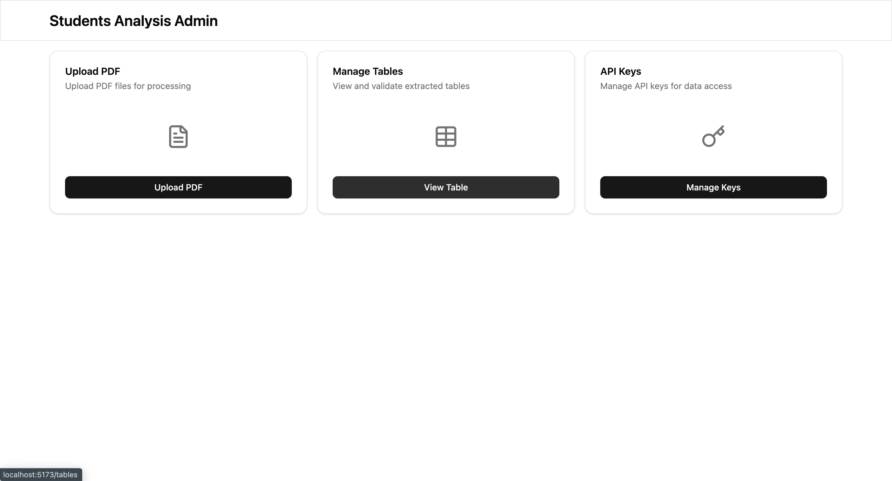
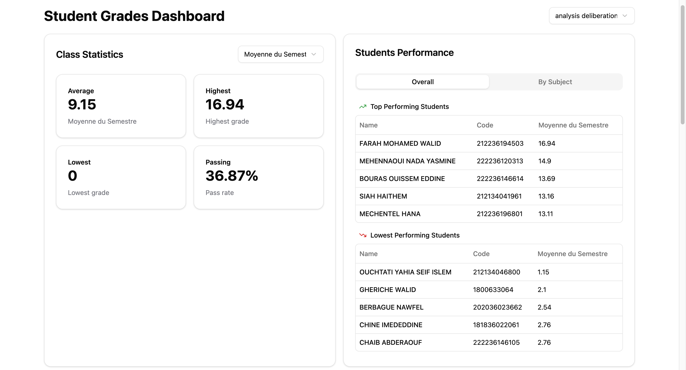
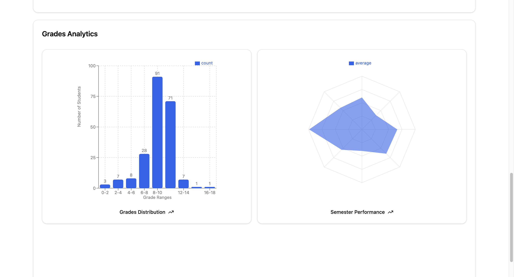

# Student Marks Analysis

A powerful web application that leverages OCR (Optical Character Recognition) and Large Language Models to automatically extract and analyze student grades from PDF transcripts. Transform your academic data into actionable insights with automated parsing, comprehensive analytics, and interactive visualizations.

## Screenshots

### Upload Interface

*Upload PDF transcripts with drag-and-drop functionality*

### Grade Analytics Dashboard

*Comprehensive overview of academic performance*

### Performance Visualizations

*Interactive charts showing GPA trends and subject performance*

## Features

### 🔍 **Smart OCR Processing**
- Upload PDF transcripts and extract text content with high accuracy
- Preprocesses and cleans extracted text for optimal analysis

### 🤖 **AI-Powered Grade Extraction**
- Uses advanced LLMs to intelligently parse grade information
- Automatically identifies courses, credits, grades, and semester data

### 📈 **Interactive Visualizations**
- Subject performance breakdowns
- Grade distribution charts
- Leaderboard implementation
