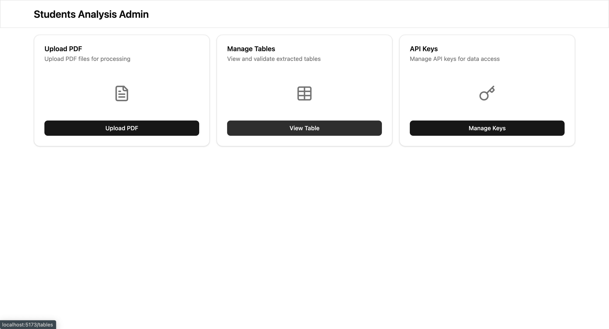
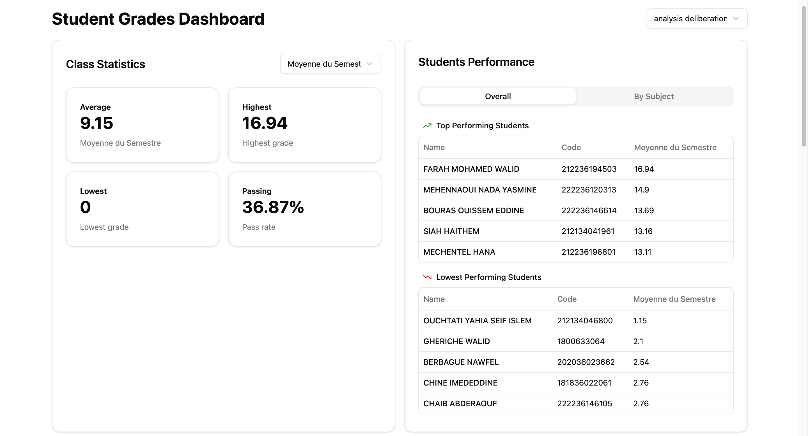
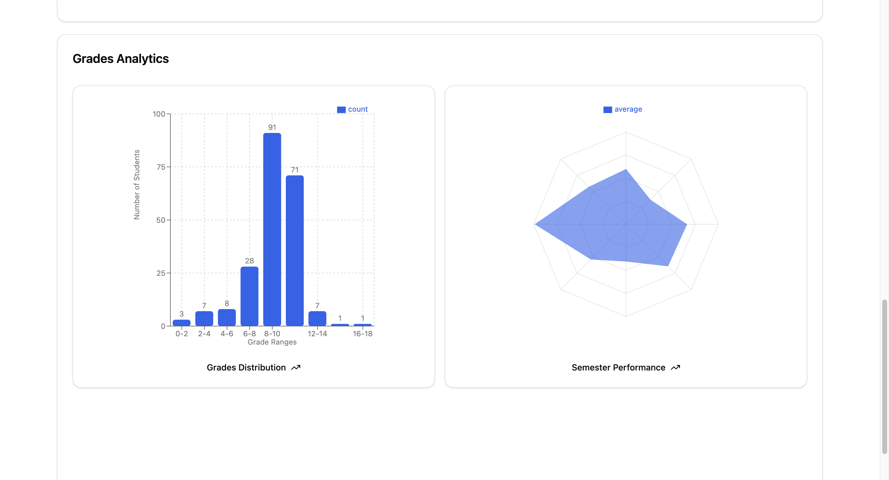

# Student Marks Analysis

Transcript Analyzer is a full-stack web app that extracts student marks from PDF transcripts, structures the data, and provides interactive analytics dashboards.

The project has:
- A Python Flask backend for PDF processing, parsing, and data APIs
- A student-facing frontend dashboard (`frontend`)
- An admin dashboard (`admin-panel`)

## Screenshots

### Upload Interface

*Upload PDF transcripts with drag-and-drop functionality*

### Grade Analytics Dashboard

*Comprehensive overview of academic performance*

### Performance Visualizations

*Interactive charts showing GPA trends and subject performance*

## Quick Start

### Prerequisites
- Python 3.11+
- `uv` package manager
- Node.js 20+ and npm

### 1) Run the backend

```bash
cd backend
uv sync
uv run python run.py
```

Backend starts on `http://localhost:3000`.

The backend reads configuration from `backend/.env`.

### 2) Run the student frontend (`frontend`)

```bash
cd frontend
npm install
npm run dev
```

### 3) Run the admin panel (`admin-panel`)

```bash
cd admin-panel
npm install
npm run dev
```

Use either `frontend` or `admin-panel` with the backend running.

## Available Scripts

### Frontend apps (`frontend` and `admin-panel`)
- `npm run dev` - Start Vite development server
- `npm run build` - Create production build
- `npm run preview` - Preview production build locally
- `npm run lint` - Run ESLint

### Backend (`backend`)
- `uv run python run.py` - Start Flask server

## Features

### 🔍 **Smart OCR Processing**
- Upload PDF transcripts and extract text content with high accuracy
- Preprocesses and cleans extracted text for optimal analysis

### 🤖 **AI-Powered Grade Extraction**
- Uses advanced LLMs to intelligently parse grade information
- Automatically identifies courses, credits, grades, and semester data

### 📈 **Interactive Visualizations**
- Subject performance breakdowns
- Grade distribution charts
- Leaderboard implementation

### 🧩 **Data and API Layer**
- AI-assisted table/header detection and structuring
- Student marks analytics and statistics endpoints
